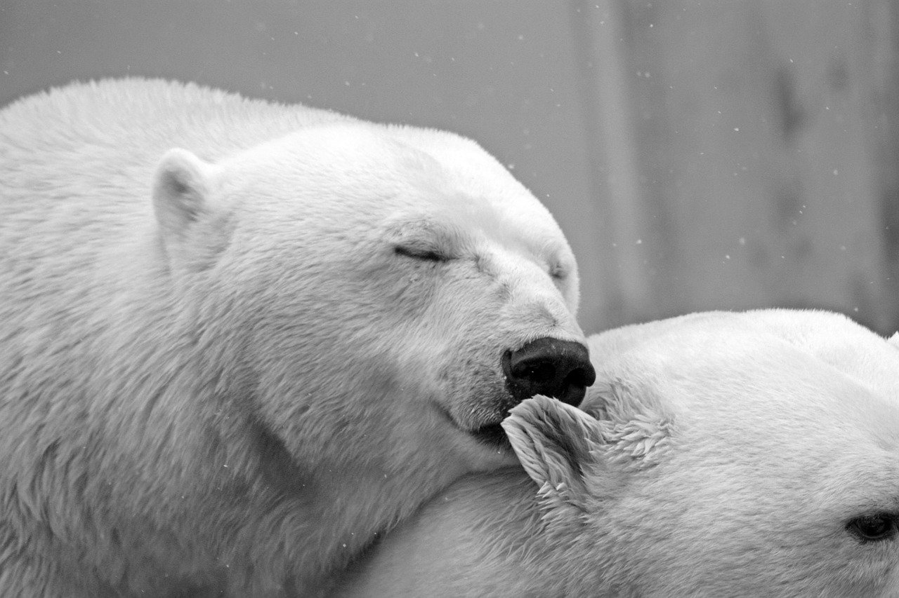

# HOMEWORK05

## 1. 4주차 과제에서 수정된 것, 추가된 것
---
### <수정사항>
- 홈페이지 테두리 부분의 여백을 제거하였고 홈페이지의 전체적인 너비를 줄였다.

- 헤더 이미지를 어둡게 하여 헤더 위의 글씨가 잘 보이도록 하였고 글씨의 위치를 우측으로 수정하였다.

- 홈 페이지의 Photo 부분에서 글의 비율을 줄이고 사진의 개수를 추가하였다. 사진의 테두리를 약간 둥글게 수정하였다.

- Schedule 부분의 배경을 제거하고 내용을 제목에 맞게 수정하였다.

### <추가사항>
- 상단 메뉴바 마지막에 Categories 항목을 추가하였고, 전체 메뉴를 확인할 수 있는 사이드메뉴도 추가로 만들었다. Categories 항목을 클릭 시 사이드메뉴가 나오도록 하였다.

- 갤러리 페이지 생성하였고, 상단메뉴바에 Gallery 항목을 클릭하면 갤러리 페이지로 넘어가도록 링크를 통해 연결하였다. 갤러리 페이지에서 대부분을 차지하고 있는 사진들은 Grid를 통해 구조를 잡았고 사진들에 대해 2D, 3D transform과 애니메이션 속성을 이용하여 효과를 추가하였다.

- 홈 페이지에서도 Photo 부분에 포함된 사진들에 대해 확대되고 회전되는 효과를 추가하였다.(2D transform, 애니메이션 속성 이용) 오른쪽에 더보기 홈버튼도 추가하였다.

- 홈 화면의 헤더이미지 위 글자에 애니메이션을 추가하였다.


## 2. 수정, 추가 사항에 대한 코드 설명
---
### <홈 페이지 코드 설명>

 ### 1) 사이드메뉴 (html코드와 css코드)

   ```html
   <nav id="side-menu" class="hidden">
      <ul class="side_menu">
         <li><a href="#">Calender</a></li>
         <li><a href="gallery.html">Gallery</a></li>
         <li><a href="#">Daily Log</a></li>
      </ul>
   </nav>
   ```
   ```javascript
   <script>
      let hidden = true;
      const menuButton = document.getElementById('menu-button');
      const sideMenu = document.getElementById('side-menu');
      menuButton.addEventListener('click', () => {
         if (hidden) {
            sideMenu.classList.remove('hidden');
            hidden = false; }
         else {
            sideMenu.classList.add('hidden');
            hidden = false;}
      });
    </script>
   ```
   + 사이드메뉴의 html 코드를 살펴보면, 구조는 크게 ul과 li태그로 구성 돼 있다. 이를 통해 세개의 항목을 가진 순서없는 목록을 만들었다.

   + 자바스크립트를 이용하여, menu-button이라는 id를 가진 요소를 클릭하면 사이드메뉴가 사라지고 나타나도록 하였다.

   ```css
   #side-menu {
      position: fixed;
           ...
      width: 210px;
      height: 400px;
      transition-duration: 500ms;
   }   
            ...
   #side-menu > ul {
      list-style: none;
      text-align: end;
   }
            ...
   ```
   + 사이드 메뉴의 너비와 높이는 각각 210, 400px로 지정하였고 위치는 position: fixed를 통해 고정시켰다.
   + transition-duration속성을 이용하여 사이드메뉴가 사라지고 나타날 때 자연스럽도록 하였다.
   + side-menu라는 id를 가진 요소의 자식 요소 중 ul 요소에 대해 list-style, text-align 속성을 이용하여 리스트 왼쪽에 점을 없앴고 오른쪽 정렬이 되도록 하였다.
---

### 2) 헤더이미지 (css코드)

```css
@keyframes slide {
    from {right: -50%; opacity: 0.5; }
    to {right:100px; opacity: 1; }
}
.header-image > h4{
    animation: slide 2.5s ;
}
.header-image p{
    animation: slide 2.5s ;
}
```
+ @keyframes를 이용해 처음엔 오른쪽에 가려지고 흐리게 보이다가 마지막엔 화면 오른쪽 공백이 100px만큼인 위치까지 이동하고 선명하게 되는 slide라는 이름의 애니메이션을 만들었다.

+ 이 애니메이션을 헤더 이미지 위에 글자들에 적용하였고 2.5초 동안 지속되도록 설정하였다.
---

### 3) Main Photo (html코드와 css코드)
```html
<main>
   <div class="main-name">
         <h2>Main Photo</h2>
         <p>Show more</p>
   </div>
   <div class="main-photo">
      <div class="main-photo1">
            
            <p>Lorem ipsum dolor sit amet.</p>  
      </div>
                     ...
      <div class="main-photo5">
            
            <p>Lorem ipsum dolor sit amet.</p>
      </div>
   </div>
</main>
```
+ Main Photo 부분이 포함된 main 요소는 크게 두개의 div요소로 이루어져 있다. 클래스 이름이 main-name인 div 요소와 클래스 이름이 main-photo인 div 요소이다.

+ 클래스 이름이 main-name인 div 요소는 자식요소가 5개이고 각 자식요소에는 하나의 이미지가 포함되어 있는 형태이다.

```css
.main-name > p:hover {
    transform: scale(0.95);
             ...
}
.main-photo {
    display: grid;
    grid-template-columns: repeat(3, 1fr);
    grid-template-rows: 200px 200px;
             ...
}
.main-photo > div > img {
    ...
    transition-duration: 500ms;
}
.main-photo > div > img:hover {
    transform: scale(1.1);
    z-index:1;
}
```
+ .main-name 요소의 자식 요소 p가 hover일 때 transform 속성을 scale(0.95)로 설정하여 크기가 0.95배 만큼 작아지게 하였다.

+ main-photo클래스는 display속성을 grid로 설정하여 사진들을 배치하였다.

+ .main-photo 요소의 후손 img 요소에 대해 transition-duration 속성을 500ms로 설정하여 이미지의 변화가 있을 때 500ms동안 자연스럽게 변화하도록 하였다.

+ transform: scale(1.1)을 통해 .main-photo 요소의 후손 img 요소가 hover일 때 1.1배로 확대되도록 설정하였다.

```css

@keyframes rotate-180deg {
    0% {transform: rotateY(180deg); opacity: 0.5;}
    100% {transform: rotateY(360deg); opacity: 1;}
}
.main-photo2, .main-photo4 {
    animation: rotate-180deg 1.48s linear 200ms;}
.main-photo1, .main-photo3, .main-photo5 {
    animation: rotate-180deg 1.5s linear;}
```
+ rotate-180deg라는 이름의 애니메이션: 처음에는 y축으로 180도 회전되고 흐린 상태로 시작되다가 마지막에는 y축으로 360도 회전된 상태, 선명한 상태로 끝나도록 설정함

+ 위 애니메이션을 .main-photo1 부터 .main-photo5 까지 모두 적용 시켰고 재생 기간은 다르게 설정하였다.

```css
.main-photo > div:nth-child(1) > img:active{
    transform: scale(1.1) translate(260px,0);}
                     ...
.main-photo > div:nth-child(5) > img:active{
    transform: scale(1.9) translate(-150px,-60px);
}
```
+ .main-photo 요소의 자식 요소들에 대한 img 요소에 대해 transform 속성 중 scale, translate함수를 이용하여, 이미지가 active 일 때 이미지가 확대되고 각 위치에 따라 가운데로 위치할 수 있도록 설정하였다.
---

### 4) Schedule (html코드와 css코드)
```html
<div class="aside-content">
    <div>
        <p>2020-10-XX</p>
            ...
    </div>
    <div>
        <p>2020-10-XX</p>
            ...
    </div>
    <div>
        <p>2020-10-XX</p>
            ...
    </div>  
</div>
```
+ Scedule 부분에서 .aside-content 요소는 크게 세 개의 div 자식요소로 구성되어 있다. 

```css
.aside-name > p:hover {
    transform: scale(0.95);
    cursor: pointer;}
```
+ .aside-name 요소의 자식요소 중 p요소가 hover일 때 0.95배 축소되고 마우스 커서가 바뀌도록 하였다.
---
### <갤러리 페이지 코드 설명>

 ### 1) 갤러리 페이지의 html코드
 ```html
...
<main>
    <div class="main-name">
        <h3>ChaeJeong's 갤러리</h3>
    </div>
    <div class="main-photo">
        <div class="photo-frame">
            
            <div class="text-frame"> ... </div>
        </div>
        <div class="photo-frame"> 
            <div class=" wrapper"> 
                ...
            </div>
            <div class="text-frame-hover"> ... </div>
        </div>
        <div class="photo-frame">
            
            <div class="text-frame"> ... </div>
        </div>
        <div class="photo-frame">
            
            <div class="text-frame"> ... </div>
        </div>
        <div class="photo-frame">
            
            <div class="text-frame"> ...</div>
        </div>
        <div class="photo-frame">
            
            <div class="text-frame"> ...</div>
        </div>
        <div class="photo-frame">
            
            <div class="text-frame"> ... </div>
        </div>
        <div class="photo-frame">
            
            <div class="text-frame"> ... </div>
        </div>
        <div class="photo-frame">
            
            <div class="text-frame"> ... </div>
        </div>
        <div class="photo-frame">
            
            <div class="text-frame"> ... </div>
        </div>
        <div class="photo-frame">
            
            <div class="text-frame"> ... </div>
        </div>
        <div class="photo-frame">
            
            <div class="text-frame"> ... </div>
        </div>
    </div>
</main>
...
```
+ 갤러리 페이지의 헤더, 사이드 메뉴는 홈 페이지와 동일하게 구성하였다.

+ 갤러리 페이지의 구성은 크게 헤더 이미지가 포함된 .main-name 요소와 12개의 이미지가 포함된 .main-photo 요소로 이루어져 있다.

+ .main-photo 요소는 12개의 div 자식 요소들로 구성 되어 있으며 자식 요소들은 모두 클래스 이름을 photo-frame으로 설정하였다. 각 div 자식 요소 안에는 이미지와 텍스트가 포함된 형태이다.

```html
<div class="photo-frame"> 
    <div class=" wrapper"> 
        <div class="face"></div>
        <div class="face"></div>
        <div class="face"></div>
        <div class="face"></div>
        <div class="face"></div>
        <div class="face"></div>
        <div><p>마우스를 올려보세요.</p></div>
    </div>
    ...
</div>
```
+ .main-photo의 자식 요소들 중 두번째 요소에 대해서는 입체적인 형태로 만들기 위해 네 개의 .face 요소가 포함된 .wrapper 요소를 포함시켰다.


 ### 2) 갤러리 페이지의 css코드
 ```css
.main-photo {
    ...
    display: grid;
    grid-template-columns: repeat(3, 400px);
    grid-auto-rows: 360px;
    ...
    column-gap: 40px;
    row-gap: 70px;
    background-color: whitesmoke;
}
```
+ 12개의 .photo-frame요소를 모두 포함한 부모 요소인 .main-photo는 display속성을 grid로 설정하여 자식요소들을 구성하였다.

+ 너비가 400px인 3개의 열을 만들고 행에 대해서는 360px이 기본으로 생성되도록 설정하였다.

+ 각 열에 대해 40px, 각 행에 대해서는 70px 만큼의 거리를 설정하였고 배경은 whitesmoke 색상으로 설정하였다. 

```css
.photo-frame >  img {
    max-height: 75%;
    max-width: 100%;
}
.text-frame{
    text-align: left;
    ...
}
```
+ .photo-frame 요소들의 자식 요소인 img에 대해서 최대 높이와 최대 너비를 75%, 100%로 하여 이미지들의 크기가 각 요소에 맞게, 일정하게 설정하였다. 

```css
.photo-frame:active img{
    transform: scale(2) ;
}
```
+ 

## 비교 및 고찰
---
- 

- 

- 


