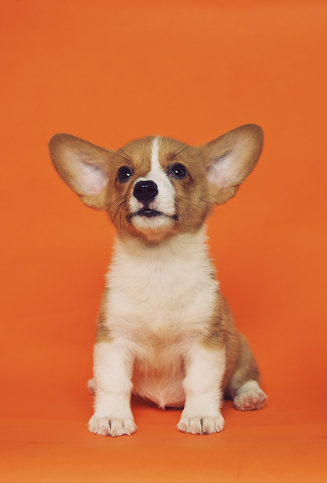

# HOMEWORK05

## 1. 4주차 과제에서 수정된 것, 추가된 것
---
### <수정사항>
- 홈페이지 테두리 부분의 여백을 제거하였고 홈페이지의 전체적인 너비를 줄였다.

- 헤더 이미지를 어둡게 하여 헤더 위의 글씨가 잘 보이도록 하였고 글씨의 위치를 우측으로 수정하였다.

- 홈 페이지의 Photo 부분에서 글의 비율을 줄이고 사진의 개수를 추가하였다. 사진의 테두리를 약간 둥글게 수정하였다.

- Schedule 부분의 배경을 제거하고 내용을 제목에 맞게 수정하였다.

### <추가사항>
- 상단 메뉴바 마지막에 Categories 항목을 추가하였고, 전체 메뉴를 확인할 수 있는 사이드메뉴도 추가로 만들었다. Categories 항목을 클릭 시 사이드메뉴가 나오도록 하였다.

- 갤러리 페이지 생성하였고, 상단메뉴바에 Gallery 항목을 클릭하면 갤러리 페이지로 넘어가도록 링크를 통해 연결하였다. 갤러리 페이지에서 대부분을 차지하고 있는 사진들은 Grid를 통해 구조를 잡았고 사진들에 대해 2D, 3D transform과 애니메이션 속성을 이용하여 효과를 추가하였다.

- 홈 페이지에서도 Photo 부분에 포함된 사진들에 대해 확대되고 회전되는 효과를 추가하였다.(2D transform, 애니메이션 속성 이용) 오른쪽에 더보기 홈버튼도 추가하였다.

- 홈 화면의 헤더이미지 위 글자에 애니메이션을 추가하였다.


## 2. 수정, 추가 사항에 대한 코드 설명
---
### <홈 페이지 코드 설명>


 ### (1) 사이드메뉴 (html코드와 css코드)

   ```html
   <nav id="side-menu" class="hidden">
      <ul class="side_menu">
         <li><a href="#">Calender</a></li>
         <li><a href="gallery.html">Gallery</a></li>
         <li><a href="#">Daily Log</a></li>
      </ul>
   </nav>
   ```
   ```javascript
   <script>
      let hidden = true;
      const menuButton = document.getElementById('menu-button');
      const sideMenu = document.getElementById('side-menu');
      menuButton.addEventListener('click', () => {
         if (hidden) {
            sideMenu.classList.remove('hidden');
            hidden = false; }
         else {
            sideMenu.classList.add('hidden');
            hidden = false;}
      });
    </script>
   ```
   + 사이드메뉴의 html 코드를 살펴보면, 구조는 크게 ul과 li태그로 구성 돼 있다. 이를 통해 세개의 항목을 가진 순서없는 목록을 만들었다.

   + 자바스크립트를 이용하여, menu-button이라는 id를 가진 요소를 클릭하면 사이드메뉴가 사라지고 나타나도록 하였다.

   ```css
   #side-menu {
      position: fixed;
           ...
      width: 210px;
      height: 400px;
      transition-duration: 500ms;
   }   
            ...
   #side-menu > ul {
      list-style: none;
      text-align: end;
   }
            ...
   ```
   + 사이드 메뉴의 너비와 높이는 각각 210, 400px로 지정하였고 위치는 position: fixed를 통해 고정시켰다.
   + transition-duration속성을 이용하여 사이드메뉴가 사라지고 나타날 때 자연스럽도록 하였다.
   + side-menu라는 id를 가진 요소의 자식 요소 중 ul 요소에 대해 list-style, text-align 속성을 이용하여 리스트 왼쪽에 점을 없앴고 오른쪽 정렬이 되도록 하였다.
---

### (2) 헤더이미지 (css코드)

```css
@keyframes slide {
    from {right: -50%; opacity: 0.5; }
    to {right:100px; opacity: 1; }
}
.header-image > h4{
    animation: slide 2.5s ;
}
.header-image p{
    animation: slide 2.5s ;
}
```
+ @keyframes를 이용해 처음엔 오른쪽에 가려지고 흐리게 보이다가 마지막엔 화면 오른쪽 공백이 100px만큼인 위치까지 이동하고 선명하게 되는 slide라는 이름의 애니메이션을 만들었다.

+ 이 애니메이션을 헤더 이미지 위에 글자들에 적용하였고 2.5초 동안 지속되도록 설정하였다.
---
### (3) Main Photo (html코드와 css코드)
```html
<main>
   <div class="main-name">
         <h2>Main Photo</h2>
         <p>Show more</p>
   </div>
   <div class="main-photo">
      <div class="main-photo1">
            
            <p>Lorem ipsum dolor sit amet.</p>  
      </div>
                     ...
      <div class="main-photo5">
            
            <p>Lorem ipsum dolor sit amet.</p>
      </div>
   </div>
</main>
```

```css
.main-name > p:hover {
    transform: scale(0.95);
    cursor: pointer;
}
.main-photo {
    display: grid;
    grid-template-columns: repeat(3, 1fr);
    grid-template-rows: 200px 200px;
             ...
}
.main-photo > div > img {
    width: 100%;
    height:100%;
    border-radius: 5%;
    ...
    transition-duration: 500ms;
}
```


```css
.main-photo > div > img:hover {
    transform: scale(1.1);
    z-index:1;
}
@keyframes rotate-180deg {
    0% {transform: rotateY(180deg); opacity: 0.5;}
    100% {transform: rotateY(360deg); opacity: 1;}
}
.main-photo2, .main-photo4 {
    animation: rotate-180deg 1.48s linear 200ms;}

.main-photo1, .main-photo3, .main-photo5 {
    animation: rotate-180deg 1.5s linear;}
```


```css
.main-photo > div:nth-child(1) > img:active{
    transform: scale(1.1) translate(260px,0);}
                     ...
.main-photo > div:nth-child(5) > img:active{
    transform: scale(1.9) translate(-150px,-60px);
}
```


### <갤러리 페이지 코드 설명>

  


## 비교 및 고찰
---
- 

- 

- 


